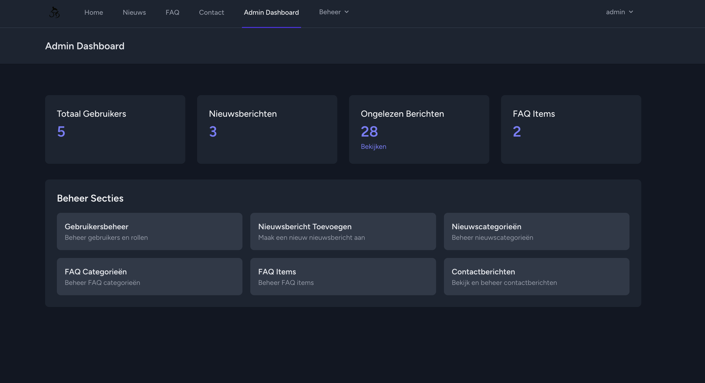
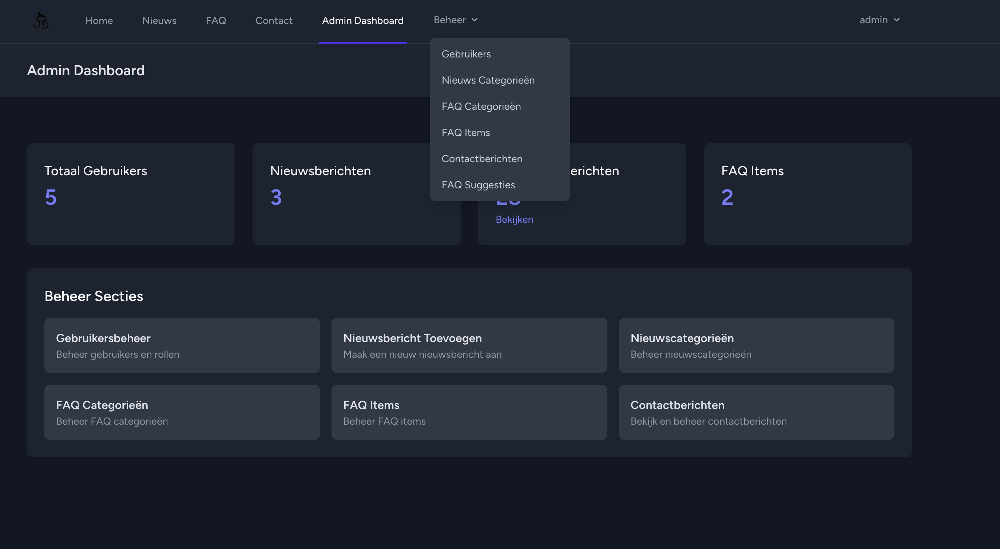
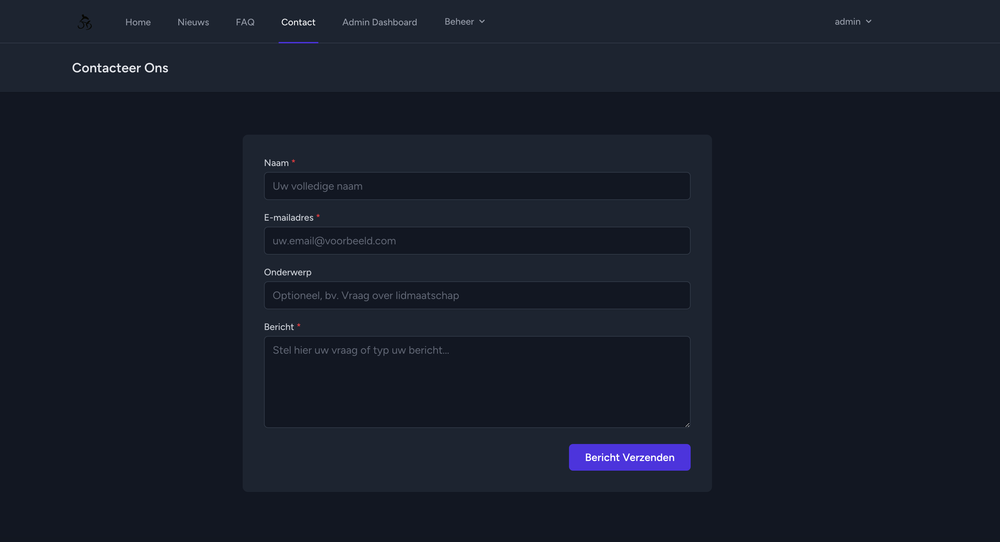
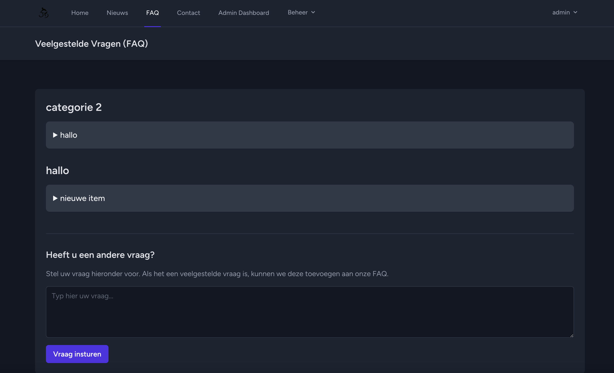
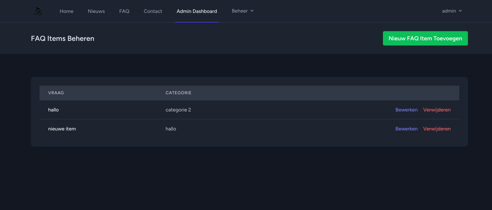
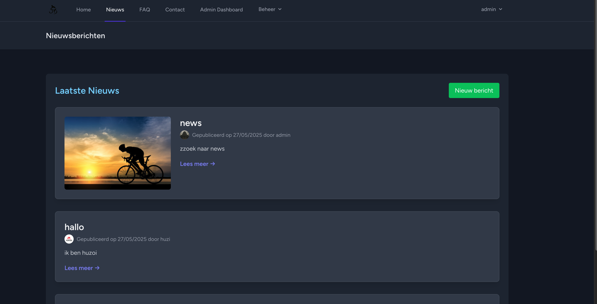

<p align="center"><a href="https://laravel.com" target="_blank"></a></p>

<p align="center">
<a href="https://github.com/laravel/framework/actions"></a>
<a href="https://packagist.org/packages/laravel/framework"></a>
<a href="https://packagist.org/packages/laravel/framework"></a>
<a href="https://packagist.org/packages/laravel/framework"></a>
</p>

## About Laravel

Laravel is a web application framework with expressive, elegant syntax. We believe development must be an enjoyable and creative experience to be truly fulfilling. Laravel takes the pain out of development by easing common tasks used in many web projects, such as:

- [Simple, fast routing engine](https://laravel.com/docs/routing).
- [Powerful dependency injection container](https://laravel.com/docs/container).
- Multiple back-ends for [session](https://laravel.com/docs/session) and [cache](https://laravel.com/docs/cache) storage.
- Expressive, intuitive [database ORM](https://laravel.com/docs/eloquent).
- Database agnostic [schema migrations](https://laravel.com/docs/migrations).
- [Robust background job processing](https://laravel.com/docs/queues).
- [Real-time event broadcasting](https://laravel.com/docs/broadcasting).

Laravel is accessible, powerful, and provides tools required for large, robust applications.

## Learning Laravel

Laravel has the most extensive and thorough [documentation](https://laravel.com/docs) and video tutorial library of all modern web application frameworks, making it a breeze to get started with the framework.

You may also try the [Laravel Bootcamp](https://bootcamp.laravel.com), where you will be guided through building a modern Laravel application from scratch.

If you don't feel like reading, [Laracasts](https://laracasts.com) can help. Laracasts contains thousands of video tutorials on a range of topics including Laravel, modern PHP, unit testing, and JavaScript. Boost your skills by digging into our comprehensive video library.

## Laravel Sponsors

We would like to extend our thanks to the following sponsors for funding Laravel development. If you are interested in becoming a sponsor, please visit the [Laravel Partners program](https://partners.laravel.com).

### Premium Partners

- **[Vehikl](https://vehikl.com)**
- **[Tighten Co.](https://tighten.co)**
- **[Kirschbaum Development Group](https://kirschbaumdevelopment.com)**
- **[64 Robots](https://64robots.com)**
- **[Curotec](https://www.curotec.com/services/technologies/laravel)**
- **[DevSquad](https://devsquad.com/hire-laravel-developers)**
- **[Redberry](https://redberry.international/laravel-development)**
- **[Active Logic](https://activelogic.com)**

## Contributing

Thank you for considering contributing to the Laravel framework! The contribution guide can be found in the [Laravel documentation](https://laravel.com/docs/contributions).

## Code of Conduct

In order to ensure that the Laravel community is welcoming to all, please review and abide by the [Code of Conduct](https://laravel.com/docs/contributions#code-of-conduct).

## Security Vulnerabilities

If you discover a security vulnerability within Laravel, please send an e-mail to Taylor Otwell via [taylor@laravel.com](mailto:taylor@laravel.com). All security vulnerabilities will be promptly addressed.

## License

The Laravel framework is open-sourced software licensed under the [MIT license](https://opensource.org/licenses/MIT).

# Fiets Club Brussel - Dynamische Website met Laravel

## 1. Projectbeschrijving en Functionaliteiten

Dit project is een dynamische website voor "Fiets Club Brussel", ontwikkeld als eindopdracht voor het vak Backend Web met Laravel 12. De website biedt een platform voor leden en geïnteresseerden van de fietsclub, met nieuws, een FAQ, en contactmogelijkheden. Het project omvat gebruikersbeheer met verschillende rollen, content management voor nieuws en FAQs, en een interactief contactformulier.

**Kernfunctionaliteiten:**

*   **Gebruikerssysteem:**
    *   Registratie en login voor alle bezoekers.
    *   Gebruikersrollen: gewone gebruiker en admin.
    *   Admin functionaliteit:
        *   Gebruikers manueel aanmaken en hun rol (gebruiker/admin) bepalen.
        *   Andere gebruikers verheffen tot admin of hun adminrechten afnemen.
*   **Profielpagina (Publiek & Privaat):**
    *   Elke gebruiker heeft een publieke profielpagina.
    *   Ingelogde gebruikers kunnen hun eigen profieldata aanpassen (gedeeltelijk via standaard Breeze profielpagina `profile.edit`, uitbreidingen zoals verjaardag, foto, `display_name`, `about_me` zijn aanwezig in `User` model en migratie).
    *   Profielvelden (optioneel): `name` (standaard), `display_name` (voor profiel), `birthday`, `profile_photo_path`, `about_me`.
*   **Nieuwssectie:**
    *   Admins kunnen nieuwsitems toevoegen, wijzigen en verwijderen.
    *   Alle bezoekers kunnen een overzicht van nieuwsitems en de details per item bekijken.
    *   Nieuwsitems bevatten: Titel, afbeelding (server-side opgeslagen), content, publicatiedatum (automatisch via `created_at`).
*   **FAQ Pagina:**
    *   Vragen en antwoorden gegroepeerd per categorie.
    *   Admins kunnen categorieën en FAQ-items beheren.
    *   Alle bezoekers kunnen de FAQ-sectie raadplegen.
*   **Contact Pagina:**
    *   Contactformulier voor alle bezoekers.
    *   Bij verzending ontvangt de admin een e-mailnotificatie.
*   **Extra Features (deels geïmplementeerd):**
    *   Admin dashboard voor het beheren van ontvangen contactberichten.
    *   Commentaarsysteem voor nieuwsberichten.
    *   Mogelijkheid voor gebruikers om FAQ-vragen voor te stellen.

## 2. Implementatie van Technische Vereisten

Hieronder een overzicht van hoe de technische vereisten zijn aangepakt:

*   **Views:**
    *   **Twee layouts:**
        *   `resources/views/layouts/app.blade.php`: Algemene layout (gebruikt door nieuws, contact, publieke FAQ, dashboard, profiel). Bevat ook logica voor session messages en validatiefouten. (Zie `resources/views/layouts/app.blade.php`, regels 28-54 voor messages).
        *   `resources/views/components/admin-layout.blade.php`: Specifieke layout voor het admin-gedeelte, gebruikt als class-based component (`<x-admin-layout>`). (Zie `app/View/Components/AdminLayout.php` en `resources/views/components/admin-layout.blade.php`).
    *   **Componenten:**
        *   `AdminLayout` is een class-based component.
        *   Laravel Breeze componenten (bv. `<x-text-input>`, `<x-primary-button>`, `<x-input-label>`, `<x-input-error>`) worden uitgebreid gebruikt in formulieren zoals `resources/views/auth/login.blade.php`, `resources/views/admin/users/create.blade.php`, `resources/views/profile/partials/update-profile-information-form.blade.php`.
        *   `app.blade.php` en `admin-layout.blade.php` gebruiken `<x-slot name="header">` voor paginatitels.
    *   **Control structures:**
        *   `@if`, `@else`, `@endif`: Bijvoorbeeld in `resources/views/news/index.blade.php` (regels 14-18) om titel aan te passen op basis van actieve categorie, of in `resources/views/layouts/app.blade.php` (regels 29, 36, 43) voor tonen van session messages.
        *   `@foreach`: Bijvoorbeeld in `resources/views/news/index.blade.php` (regel 35) voor categorieën en (regel 47) voor nieuwsitems. Ook in `resources/views/admin/users/create.blade.php` (regel 46) voor rollen.
        *   `@forelse`, `@empty`: In `resources/views/news/index.blade.php` (regel 47, 88) om nieuwsitems te tonen of een melding als er geen zijn.
        *   `@can`, `@endcan`: In `resources/views/news/index.blade.php` (regel 20) om "Nieuw bericht" knop te tonen aan geautoriseerde gebruikers.
        *   `@auth`, `@guest`: De navigatie in `resources/views/layouts/navigation.blade.php` (bv. regels 34, 103) toont verschillende links afhankelijk van of de gebruiker is ingelogd.
        *   `@csrf`: In alle POST formulieren, bv. `resources/views/contact/create.blade.php` (regel 13).
        *   `@include`: In `resources/views/layouts/app.blade.php` (regel 17) en `resources/views/components/admin-layout.blade.php` (regel 18) voor de navigatie.
    *   **XSS Protection:** Standaard Blade `{{ }}` syntax wordt gebruikt voor output, bv. `{{ $item->title }}` in `resources/views/news/index.blade.php` (regel 59). Waar HTML nodig is met `Str::limit`, wordt `e()` gebruikt voor escaping: `{!! Str::limit(nl2br(e($item->content)), ...) !!}` (regel 80).
    *   **CSRF Protection:** Alle formulieren die data submitten (POST, PUT, PATCH, DELETE) gebruiken de `@csrf` directive. Voorbeelden: `resources/views/contact/create.blade.php` (regel 13), `resources/views/admin/users/create.blade.php` (regel 11).
    *   **Client-side validation:** Standaard HTML5 attributen zoals `required`, `type="email"` worden gebruikt. Voorbeeld: `resources/views/contact/create.blade.php` (regels 17, 27).

*   **Routes (`routes/web.php`):**
    *   **Alle routes gebruiken controller methods:** Er zijn geen routes met closures meer voor de hoofdfunctionaliteit. Voorbeeld: `Route::get('/news', [NewsController::class, 'index'])` (regel 38).
    *   **Alle routes gebruiken de nodige middleware:**
        *   `auth`: bv. `Route::get('/news/create', 'create')->middleware('auth')` (regel 39).
        *   `verified`: bv. `Route::get('/dashboard', ...)->middleware(['auth', 'verified'])` (regel 27).
        *   `\App\Http\Middleware\AdminMiddleware::class`: Voor de gehele admin groep (regel 49).
    *   **Routes groeperen:**
        *   `Route::middleware(['auth'])->group(...)` voor algemene ingelogde gebruikers (regel 29).
        *   `Route::controller(NewsController::class)->group(...)` voor nieuws routes (regel 37).
        *   Admin routes zijn gegroepeerd met `->prefix('admin')->name('admin.')` en de `AdminMiddleware` (regel 49).

*   **Controller (`app/Http/Controllers/`):**
    *   **Logica opgesplitst:** Elke entiteit/functionaliteit heeft zijn eigen controller. Bijvoorbeeld, `NewsController.php` voor nieuws, `ContactController.php` voor het contactformulier, `Admin\UserController.php` voor gebruikersbeheer door admins.
    *   **Resource controllers (gedeeltelijk):**
        *   `Route::resource('news-categories', AdminNewsCategoryController::class)->except(['show'])` (regel 57).
        *   `Route::resource('faq-categories', AdminFaqCategoryController::class)->except(['show'])` (regel 60).
        *   `Route::resource('faq-items', AdminFaqItemController::class)->except(['show'])` (regel 63).
        *   `Route::resource('contact-messages', AdminContactMessageController::class)->except(...)` (regel 66).
        *   `Admin\UserController.php` is niet als resource route gedefinieerd maar implementeert de methodes (`index`, `create`, `store`, `edit`, `update`) die typisch zijn voor resource management.

*   **Models (`app/Models/`):**
    *   **Eloquent models per entiteit:** `User.php`, `News.php`, `Comment.php`, `ContactMessage.php`, `FaqCategory.php`, `FaqItem.php`, `FaqSuggestion.php`, `NewsCategory.php`.
    *   **Relaties:**
        *   **One-to-Many:**
            *   `User` naar `News`: `User->news()` (`app/Models/User.php`, regel 50). `News` naar `User`: `News->user()` (`app/Models/News.php`, regel 29).
            *   `User` naar `Comment`: `User->comments()` (nog toe te voegen aan `app/Models/User.php`). `Comment` naar `User`: `Comment->user()` (`app/Models/Comment.php`, regel 26).
            *   `News` naar `Comment`: `News->comments()` (`app/Models/News.php`, regel 46). `Comment` naar `News`: `Comment->news()` (`app/Models/Comment.php`, regel 34).
            *   `FaqCategory` naar `FaqItem`: `FaqCategory->faqItems()` (`app/Models/FaqCategory.php`, regel 48). `FaqItem` naar `FaqCategory`: `FaqItem->faqCategory()` (`app/Models/FaqItem.php`, regel 28).
        *   **Many-to-Many:**
            *   `News` naar `NewsCategory`: `News->categories()` en `NewsCategory->newsItems()` (zie `app/Models/News.php` regel 37 en `app/Models/NewsCategory.php` - daar moet nog een `newsItems()` relatie toegevoegd worden). De pivot tabel is `news_item_category`.

*   **Database:**
    *   **`php artisan migrate:fresh --seed`:** Dit commando zal werken. Migraties zijn in `database/migrations/`.
    *   **Nodige basisdata:** `DatabaseSeeder.php` (in `database/seeders/`) roept `AdminUserSeeder.php` en (indien aanwezig/nodig) andere seeders aan.
        *   `AdminUserSeeder.php` maakt de default admin aan (zie `database/seeders/AdminUserSeeder.php`).
    *   Geconfigureerd voor SQLite, maar overzetbaar.

*   **Authentication (Laravel Breeze):**
    *   **Standaard functionaliteiten:** Login (`resources/views/auth/login.blade.php`), logout (via `layouts.navigation.blade.php`), 'Remember me' (op login formulier), Registreer (`resources/views/auth/register.blade.php`).
    *   **Wachtwoord reset:** Functionaliteit is aanwezig via Breeze (routes in `routes/auth.php`, views in `resources/views/auth/`).
    *   **Default admin:**
        *   Username: `admin`
        *   Email: `admin@ehb.be`
        *   Password: `Password!321`
        (Gedefinieerd in `database/seeders/AdminUserSeeder.php`, regel 15-20).

*   **Layout:**
    *   Gebruik van Tailwind CSS via Vite. Dark mode ondersteuning is consistent door de layouts en componenten. (Zie `tailwind.config.js` voor dark mode configuratie, en CSS klassen zoals `dark:bg-gray-800`, `dark:text-gray-200` in de views).

## 3. Installatiehandleiding

1.  **Clone de repository:**
    ```bash
    git clone https://github.com/huzeyfeyer/fietst_club.git
    cd fietst_club
    ```

2.  **Installeer PHP dependencies:**
    ```bash
    composer install
    ```

3.  **Maak een `.env` bestand:**
    Kopieer `.env.example` naar `.env`:
    ```bash
    cp .env.example .env
    ```
    Configureer je database connectie in `.env`. Standaard staat deze ingesteld voor SQLite. Als je SQLite gebruikt, zorg dat het bestand `database/database.sqlite` bestaat (je kunt het aanmaken met `touch database/database.sqlite`).

    Pas ook je Mailtrap (of andere mail provider) credentials aan in `.env`:
    ```env
    MAIL_MAILER=smtp
    MAIL_HOST=sandbox.smtp.mailtrap.io
    MAIL_PORT=2525
    MAIL_USERNAME=jouw_mailtrap_username
    MAIL_PASSWORD=jouw_mailtrap_password
    MAIL_ENCRYPTION=tls
    ```

4.  **Genereer de applicatiesleutel:**
    ```bash
    php artisan key:generate
    ```

5.  **Draai de database migraties en seeders:**
    Dit maakt de tabellen aan en vult de database met initiële data (inclusief de admin gebruiker).
    ```bash
    php artisan migrate:fresh --seed
    ```

6.  **Installeer NPM dependencies en compileer assets:**
    ```bash
    npm install
    npm run dev
    ```
    (Voor productie: `npm run build`)

7.  **Start de lokale ontwikkelserver:**
    ```bash
    php artisan serve
    ```
    De applicatie is nu beschikbaar op `http://localhost:8000`.

8.  **Start de queue worker:**
    Voor het verwerken van e-mails (zoals contactformulier notificaties) via de queue:
    ```bash
    php artisan queue:work
    ```

## 4. Screenshots van de Applicatie

Hieronder enkele screenshots die een impressie geven van de website en de admin-functionaliteiten. Alle afbeeldingen zijn opgeslagen in de `docs/images/` map.

*   **Admin Dashboard:** Overzichtspagina voor beheerders.
    

*   **Admin Gebruikersbeheer:** Pagina voor het beheren van gebruikers en hun rollen.
    

*   **Contact Pagina:** Formulier waarmee bezoekers contact kunnen opnemen.
    

*   **FAQ Pagina:** Overzicht van veelgestelde vragen en antwoorden.
    

*   **Item Toevoegen (Admin):** Voorbeeld van een formulier voor het toevoegen van content (bv. nieuws of FAQ-item).
    

*   **Nieuwspagina:** Overzicht van de nieuwsberichten.
    

## 5. Gebruikte Bronnen

*   **Officiële Laravel Documentatie:** [https://laravel.com/docs/10.x](https://laravel.com/docs/10.x) (Aangepast naar Laravel 10.x, pas aan indien je expliciet Laravel 12 volgt en er significante verschillen zijn voor de gebruikte features)
*   **Tailwind CSS Documentatie:** [https://tailwindcss.com/docs](https://tailwindcss.com/docs)
*   **Laravel Breeze:** Voor authenticatie scaffolding.
*   **Mailtrap:** Voor het testen van e-mail functionaliteit.
*   **Stack Overflow:** Voor algemene probleemoplossing en specifieke codevoorbeelden. [https://stackoverflow.com](https://stackoverflow.com)
    *   Hulp bij het oplossen van problemen met e-mailontvangst in Mailtrap: [Mailtrap not recieving emails sent from my webapp](https://stackoverflow.com/questions/78930760/mailtrap-not-recieving-emails-sent-from-my-webapp)
    *   Verduidelijking over het gebruik van `Auth::check()` vs `auth()->check()`: [Auth::check() vs auth()->check()](https://stackoverflow.com/questions/77412467/authcheck-vs-auth-check)
*   **AI Chatlog (Gemini, ChatGBT):** Intensief gebruikt voor pair programming, waaronder:
    *   Debuggen van e-mailverzending (Mailtrap configuratie, queue problemen, RFC 2822 fouten).
    *   Assistentie bij het opstellen en structureren van dit README bestand.
    *   Hulp bij het implementeren van controller logica en model relaties.
   

---


